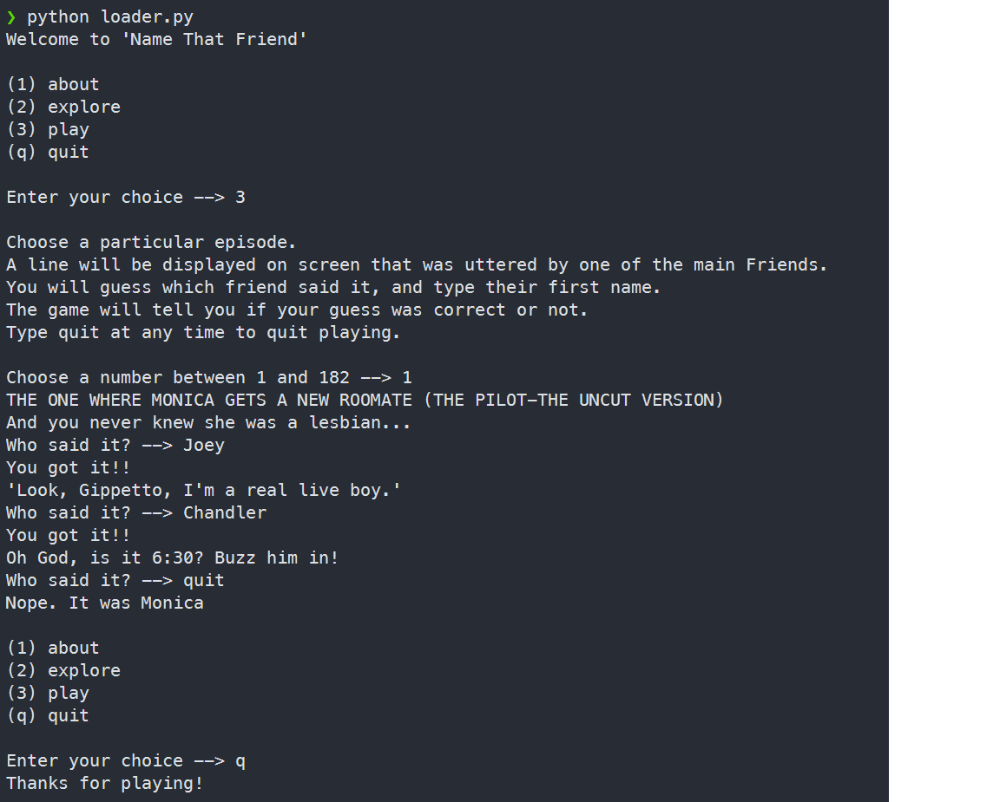
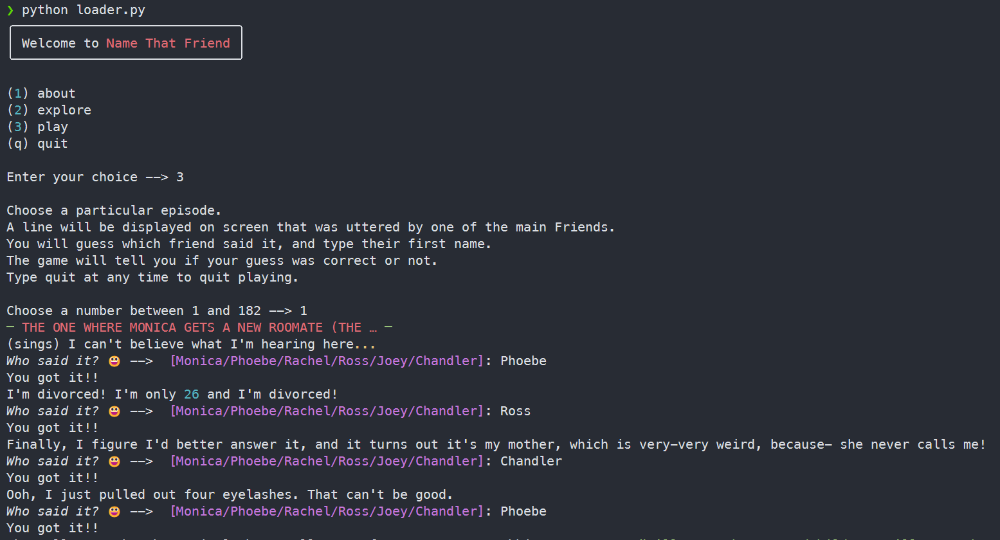

# WHICH FRIEND?

This is a simple text-based game. When run on the command line, 
the code will display a line of text from the TV show Friends.
The user must guess which friend said the line.

The full text of all seasons of Friends was obtained from
https://www.kaggle.com/datasets/divyansh22/friends-tv-show-script 
and the unzipped version is contained in this repo for convenience.

The real purpose of this project is to play around with the
[Rich|https://github.com/Textualize/rich] open-source project,
being developed by Will McGugan.

Here's a screenshot of the screen with vanilla python.

By importing rich, and adding a few small customizations, this already looks nicer (colors, italics, box)

Hoping to play around with this more in the next few week and learn more about the many bells and whistles that Rich can add. 